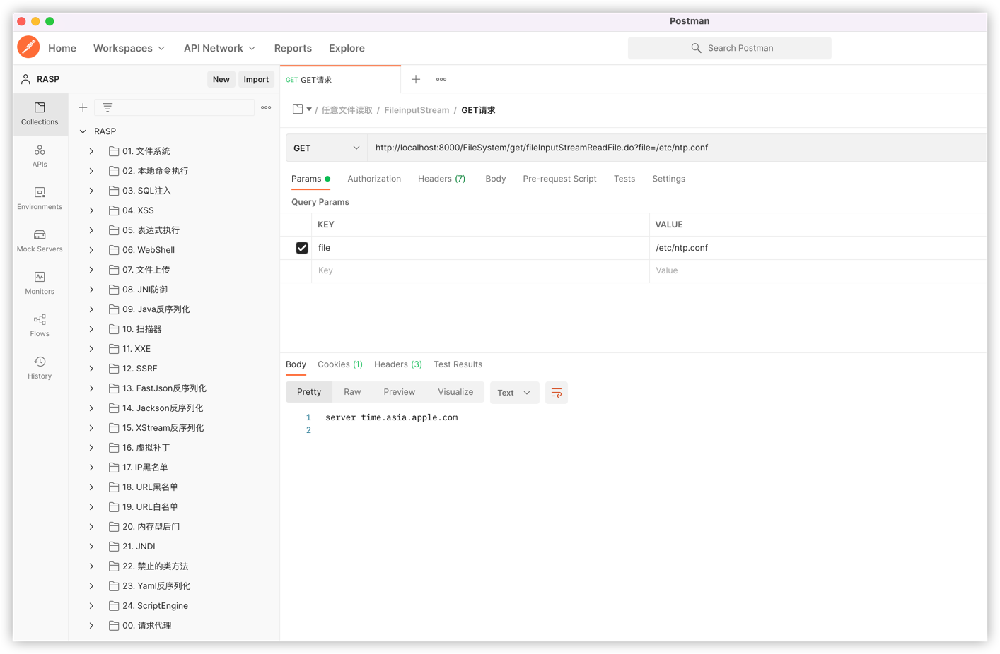

# JavaWeb RASP漏洞测试环境

## 构建方式

由于vuln-springboot3使用的是JDK17 + Spring 6，因此该模块必须使用JDK17才能编译该模块（不要使用aliyun的maven仓库），执行：

```bash
cd javaweb-vuln
mvn clean install
```
打包后的vuln-test采用的是JDK7编译的，vuln-springboot2是JDK1.8，vuln-springboot3是JDK17，运行不同的测试靶场时候需要注意JDK版本。

## 使用说明

1. JavaEE、Jakarta EE、SpringBoot2、SpringBoot3；
2. 默认使用数据库是Sqlite，不需要安装或配置数据库；
3. 导入[RASP靶场测试.json](./RASP靶场测试.json)到[Postman](https://www.postman.com/)中即可测试。
4. 内存马和JNI功能需要在vuln-test模块中才能测试；
5. 漏洞示例程序在vuln-core中有源码，postman的payload仅供参考，可随意修改为其他攻击参数；
6. 所有和命令执行相关的点都执行的是`curl localhost:8888`，比如Java反序列化，因此为了便于观测，建议测试时执行：`nc -vv -l 8888`；
7. 部分示例程序发送攻击payload时会返回500错误，是正常情况不影响测试，如有疑问请参考vuln-core的示例代码；

## Postman

下载地址：[https://www.postman.com/downloads/](https://www.postman.com/downloads/)

导入方式：点击`File` -> `Import`，如下图：

