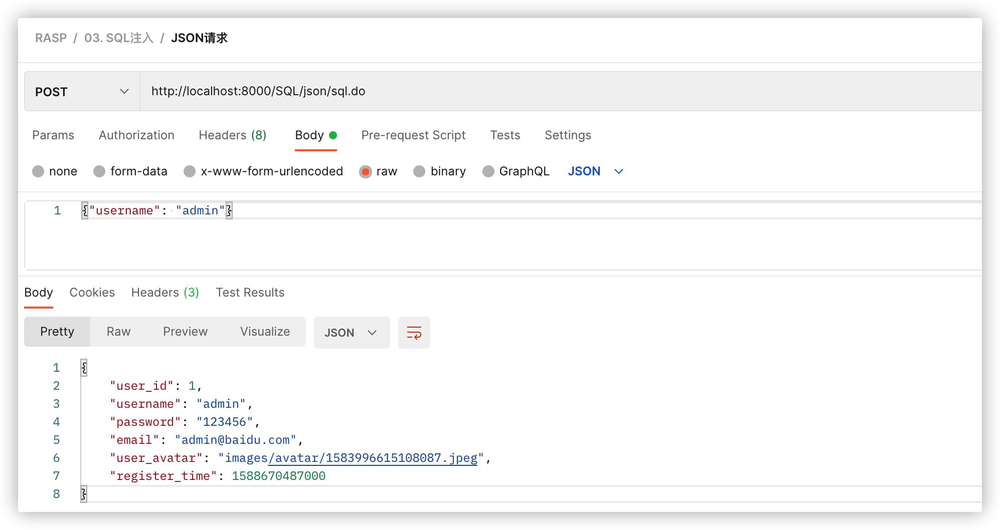

# JavaWeb RASP漏洞测试环境

这是一个用于测试RASP/IAST的Java靶场，包含了非常多的漏洞类型，该靶场由多个模块组成，示例程序基本上都在`vuln-core`项目中有详尽的分类，测试过程中如遇到问题请及时反馈，非常感谢！


## 构建方式

由于`vuln-springboot3`使用的是JDK17 + Spring 6，因此该模块必须使用JDK17才能编译该模块（不要使用aliyun的maven仓库），执行：

```bash
cd javaweb-vuln
mvn clean install
```
打包后的`vuln-test`采用的是JDK7编译的，`vuln-springboot2`是JDK1.8，`vuln-springboot3`是JDK17，运行不同的测试靶场时候需要注意JDK版本。


## 使用说明

1. JavaEE、Jakarta EE、SpringBoot2、SpringBoot3；
2. 默认使用数据库是Sqlite，不需要安装或配置数据库；
3. 导入[RASP靶场测试.json](./RASP靶场测试.json)到[Postman](https://www.postman.com/)中即可测试。
4. 内存马和JNI功能需要在vuln-test模块中才能测试；
5. 漏洞示例程序在`vuln-core`中有源码，Postman的payload仅供参考，可随意修改为其他攻击参数；
6. 所有和命令执行相关的点都执行的是`curl localhost:8888`，比如Java反序列化，因此为了便于观测，建议测试时执行：`nc -vv -l 8888`；
7. 部分示例程序发送攻击payload时会返回500错误，是正常情况不影响测试，如有疑问请参考`vuln-core`的示例代码；
7. 部分示例仅使用于`Linux/OSX`，如：本地命令执行中的`UnixProcess`示例；
7. 测试文件上传时需要选择一个jsp/jspx文件并修改上传的目录，否则会报错；
7. `URL黑名单`、`URL白名单`、`IP黑名单`、`虚拟补丁`需要在RASP云端编辑测试规则才能测试，`扫描器`测试目前只配置了：`sqlmap,nmap,masscan`，可在云端修改规则；


## Postman

下载地址：[https://www.postman.com/downloads/](https://www.postman.com/downloads/)

导入方式：点击`File` -> `Import`，如下图：


测试文件上传时需要选择一个jsp/jspx文件并修改上传的目录，否则会报错，如下图：


## 压力测试

> Java应用程序在预热阶段时候测试的性能会特别差，不适合计入压测结果，测试时需要忽略第一次压测结果。如果测试时发现连续两次压测结果相差很大，建议重新测试。


压测靶场可选择：[vuln-test](https://github.com/javaweb-rasp/javaweb-vuln/tree/master/vuln-test)、 [vuln-springboot2](https://github.com/javaweb-rasp/javaweb-vuln/tree/master/vuln-springboot2)、[vuln-springboot3](https://github.com/javaweb-rasp/javaweb-vuln/tree/master/vuln-springboot3)

压测工具推荐使用：[wrk](https://github.com/wg/wrk)、[Apache JMeter](https://jmeter.apache.org/)

测试接口：`http://localhost:8000/SQL/json/sql.do`

接口描述：API使用JSON方式传参：`{"username": "admin"}`，然后使用`Spring JdbcTemplate`查询用户名为`admin`的用户数据。

**示例 - JSON查询用户信息接口代码：**

```java
@RestController
@RequestMapping("/SQL/")
public class SQLInjectionController {
    @PostMapping(value = "/json/sql.do", consumes = APPLICATION_JSON_VALUE)
    public Map<String, Object> jsonSQL(@RequestBody Map<String, Object> map) {
        String sql = "select * from sys_user where username = '" + map.get("username") + "'";

        return jdbcTemplate.queryForMap(sql);
    }
}
```

完整代码请参考：[org.javaweb.vuln.controller.SQLInjectionController#jsonSQL](https://github.com/javaweb-rasp/javaweb-vuln/blob/master/vuln-core/src/main/java/org/javaweb/vuln/controller/SQLInjectionController.java#L46)



**RASP性能测试流程：**

1. 添加RASP启动参数后启动Web服务；
2. 启动VisualVM监控容器进程；（可省略）；
3. 使用wrk连续5次压测某个接口并记录每一次的压测数值；
4. 停止Web服务；
5. 去掉RASP启动参数并按照步骤1-3重新测试未安装RASP时性能数据；
6. 计算安装RASP和未安装RASP的压测结果；

curl测试：
```bash
curl -i "http://localhost:8000/SQL/json/sql.do" -H "Content-Type: application/json" -d '{"username": "admin"}'
```

测试参数：`wrk -t200 -c500 -d30s --script=/Users/yz/user.lua --latency "http://localhost:8000/SQL/json/sql.do"`，200个线程，500个连接数，持续时间为30秒。

**user.lua:**

```lua
wrk.method = 'POST'
wrk.headers['Content-Type'] = 'application/json'
wrk.body = '{"username": "admin"}'
```


## Docker镜像

获取方式：`docker pull javasec/javaweb-vuln:latest`

该镜像会同时启动[javaweb-vuln](https://github.com/javaweb-rasp/javaweb-vuln)中的三个靶场，启动方式容器时需要同时映射8001、8002、8003端口，如下：

```
docker run -d -it -p 8001-8003:8001-8003 --name javaweb-vuln javasec/javaweb-vuln
```


## 端口和JDK版本

1. [vuln-test](https://github.com/javaweb-rasp/javaweb-vuln/tree/master/vuln-test) -> `8001`端口，`OpenJDK 1.8.0_322`
2. [vuln-springboot2](https://github.com/javaweb-rasp/javaweb-vuln/tree/master/vuln-springboot2) -> `8002`端口，`OpenJDK 1.8.0_322`
3. [vuln-springboot3](https://github.com/javaweb-rasp/javaweb-vuln/tree/master/vuln-springboot3) -> `8003`端口，`OpenJDK 17.0.2`
