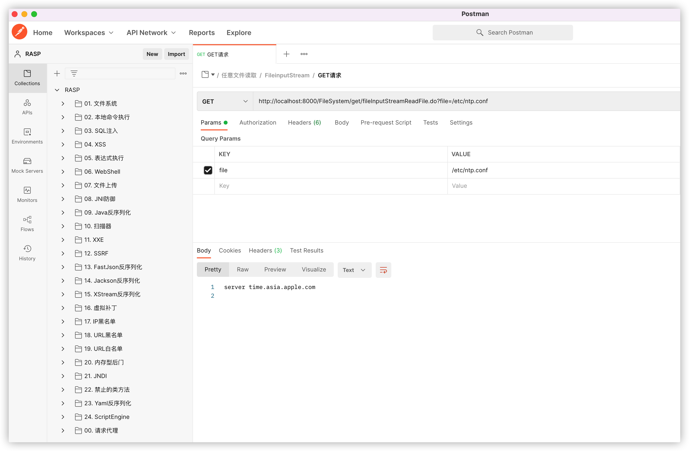
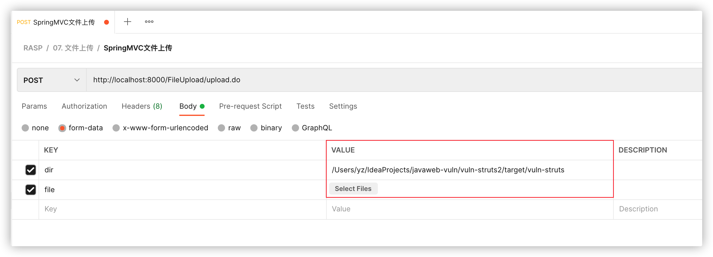

# JavaWeb RASP漏洞测试环境

这是一个用于测试RASP/IAST的Java靶场，包含了非常多的漏洞类型，该靶场由多个模块组成，示例程序基本上都在`vuln-core`项目中有详尽的分类，测试过程中如遇到问题请及时反馈，非常感谢！


## 构建方式

由于`vuln-springboot3`使用的是JDK17 + Spring 6，因此该模块必须使用JDK17才能编译该模块（不要使用aliyun的maven仓库），执行：

```bash
cd javaweb-vuln
mvn clean install
```
打包后的`vuln-test`采用的是JDK7编译的，`vuln-springboot2`是JDK1.8，`vuln-springboot3`是JDK17，运行不同的测试靶场时候需要注意JDK版本。


## 使用说明

1. JavaEE、Jakarta EE、SpringBoot2、SpringBoot3；
2. 默认使用数据库是Sqlite，不需要安装或配置数据库；
3. 导入[RASP靶场测试.json](./RASP靶场测试.json)到[Postman](https://www.postman.com/)中即可测试。
4. 内存马和JNI功能需要在vuln-test模块中才能测试；
5. 漏洞示例程序在`vuln-core`中有源码，Postman的payload仅供参考，可随意修改为其他攻击参数；
6. 所有和命令执行相关的点都执行的是`curl localhost:8888`，比如Java反序列化，因此为了便于观测，建议测试时执行：`nc -vv -l 8888`；
7. 部分示例程序发送攻击payload时会返回500错误，是正常情况不影响测试，如有疑问请参考`vuln-core`的示例代码；
7. 部分示例仅使用于`Linux/OSX`，如：本地命令执行中的`UnixProcess`示例；
7. 测试文件上传时需要选择一个jsp/jspx文件并修改上传的目录，否则会报错；
7. `URL黑名单`、`URL白名单`、`IP黑名单`、`虚拟补丁`需要在RASP云端编辑测试规则才能测试，`扫描器`测试目前只配置了：`sqlmap,nmap,masscan`，可在云端修改规则；


## Postman

下载地址：[https://www.postman.com/downloads/](https://www.postman.com/downloads/)

导入方式：点击`File` -> `Import`，如下图：



测试文件上传时需要选择一个jsp/jspx文件并修改上传的目录，否则会报错，如下图：

